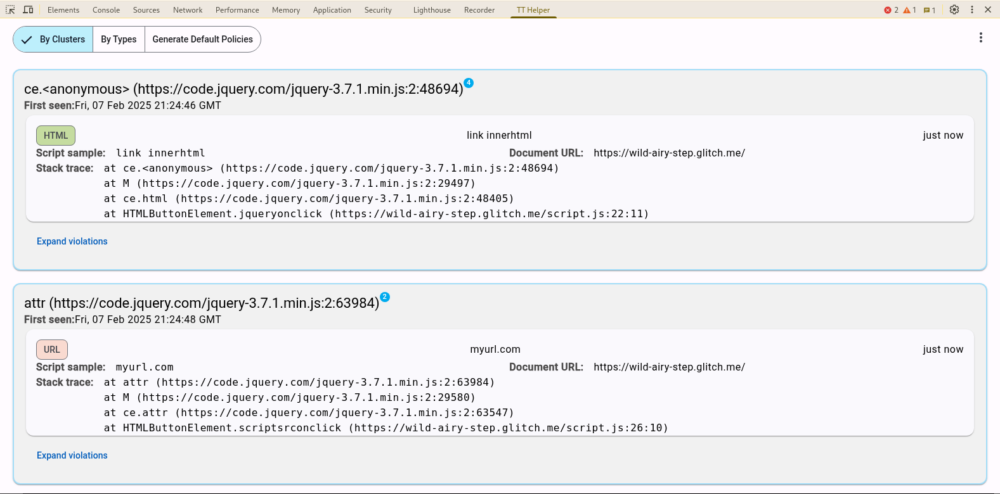

# Trusted Types Helper 🕸💉

**Debug Trusted Types with Ease: Find and Fix Violations Directly in DevTools**
🧰

Trusted Types Helper is a Chrome Extension designed to streamline the adoption
of Trusted Types in web applications. It helps developers understand, identify,
and resolve Trusted Types violations directly within their browser, making the
adoption of
[this runtime security mitigation](https://web.dev/articles/trusted-types)
easier and more efficient. 🚀

For more information on Trusted Types please see
https://web.dev/articles/trusted-types and checkout our
[blogpost](https://bughunters.google.com/blog/6037890662793216/enabling-trusted-types-in-a-complex-web-application-a-case-study-of-appsheet)
detailing how we rollout Trusted Types to a complex web application.

## Features

- **Effortless Trusted Types Violation Tracking:** 🎯 Injects necessary Trusted
  Types headers and defines a permissive default policy on every tab. This setup
  allows you to _detect and observe_ Trusted Types violations in real-time
  without disrupting website functionality. The default policy ensures all
  values are allowed, while still meticulously capturing violation reports for
  analysis in the DevTools tab. This does not enforce Trusted Types which would
  block insecure String assignments to DOM injection sinks, but it creates an
  environment to understand and debug potential integration issues.
- **Violation Reporting in DevTools:** 📊 Presents detailed reports of Trusted
  Types violations directly within a dedicated "TT Helper" tab in Chrome
  DevTools, providing immediate feedback and context.
- **Violation Clustering:** 🧩 Groups similar violations based on their root
  cause (the line of code triggering the violation), simplifying analysis and
  highlighting the most critical issues.
- **Organized Views:** 👀 Offers two distinct views within the DevTools tab: "By
  Cluster" for focusing on root causes and "By Type" (Script, URL, HTML) for
  analyzing violations based on the Trusted Types API they involve.
- **Policy Suggestion:** 💡 Analyzes Trusted Types violations encountered on the
  active tab and suggests a tailored default policy to address those specific
  violations, accelerating policy creation.

## Credits

Made with ❤️ by your
[friendly neighborhood Google security engineers](https://bughunters.google.com/about)
and their amazing interns!

## Disclaimer

This is not an officially supported Google product.
